<h1 align="center">Wishing-Willow</h1>

<p align="center">
  <b>Shows what Claude thinks you asked, next to what you actually said.</b><br>
  A Claude Code plugin, and a notch island for macOS that drops the two side by side the moment Claude writes how it read you.
</p>

<p align="center">English · <a href="README.zh-CN.md">简体中文</a></p>

https://github.com/user-attachments/assets/20888d35-8090-41a3-9bf3-b2b1a818af73

<p align="center"><sub>The 40-second launch film. The session in it is made up; the island is the real app, recorded on a plain backdrop. The voiceover is synthetic.</sub></p>

I built Wishing-Willow because Claude sometimes reads my request a little differently from what I meant, and the reply reads well enough that I don't catch it for several turns. At the start of each turn a hook saves my prompt verbatim on my machine and asks Claude to write one line on how it read it. The moment that line appears, a small card drops from the notch with my words and Claude's reading side by side.

It doesn't score the two, it doesn't block anything, and its records stay on your Mac. Whether they agree is yours to judge — that is the whole design.

<p align="center">
  
</p>

<table>
  <tr>
    <td width="50%">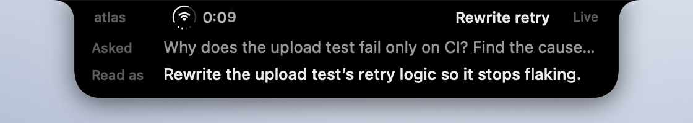</td>
    <td width="50%">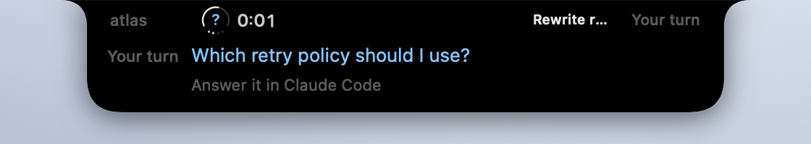</td>
  </tr>
  <tr>
    <td><b>Asked for a diagnosis, read as a rewrite.</b> The request says <i>don’t change any code</i>; the reading says <i>rewrite the retry logic</i>. Claude didn’t mark it, so the card stays white. Seeing the gap is up to you.</td>
    <td><b>Claude stopped to ask you something.</b> The card shows the question and sends you back to Claude Code. It never answers for you.</td>
  </tr>
</table>

<sub>Every session in these images is made up. They were recorded on a plain backdrop by <a href="macos/scripts/readme-media.sh"><code>macos/scripts/readme-media.sh</code></a>, driving the real plugin hook and the real app.</sub>

---

## Why I built it

In the conversation that produced this plugin, the same thing happened three times. The first time, I asked for "the general logic behind this class of problem, something reusable"; Claude read it as "audit this specific repository for evidence" and spent two turns doing that. I caught it on turn three. Every reply along the way had read perfectly reasonably.

The next day I asked for a window that would let me make sure the model is aligned with what I said. The smallest version came first: every turn, Claude writes down how it read the request.

Claude Code already has an answer for part of this — **plan mode**, whose own
documentation gives almost exactly this example: you ask for two lines of
middleware, the model plans a pipeline rewrite, and the plan surfaces the gap
before the first edit.

But plan mode triggers on **how much will change** — three or more files, a schema,
security-sensitive code — and the official guidance says to skip it for
"tiny one-file edits or read-only questions." All three drifts above happened
during **read-only investigation**. Zero files changed. Nothing to trigger on.

Willow covers that gap, and only that gap. It is not a replacement for plan mode.

## What I found when I labeled my own turns

The day after installing the plugin I went back over its first five hours and labeled 27 turns by hand: 14 aligned, 9 misread, 4 I couldn't call. Of the 9 misreads, I caught none while they were happening, 2 afterwards, and 3 only while labeling; for the other 4 I didn't note when. Two of the nine carried Claude's own ⚠ on the reading, and I still let them through. For most of those turns the lines only showed up in the chat and the status line.

The misreads looked ordinary. I said it was fine to send something; Claude read "get it ready so you can send it." I asked to talk through a design; it read "build the candidates first." One part of a request was dropped. A question was swapped for the one next to it. A step order the request never asked for was added.

So the lines were being written, and I wasn't seeing them. That is why the island pops the two lines up at the moment they are written instead of leaving them in the scrollback.

This is a small sample of my own turns, labeled by me; 72 more pairs from that day are unlabeled. It shows that drift happens and goes unnoticed. It doesn't say how often, and nothing here yet shows that the island reduces it.

## Install

**1 — the plugin** (hooks start working immediately)

```
/plugin marketplace add yha9806/wishing-willow
/plugin install willow@wishing-willow
```

**2 — the status line** (a plugin cannot ship a `statusLine`; this step is unavoidable)

```
/willow:setup
```

It prints a snippet for your `~/.claude/settings.json`. **It does not edit your
settings for you.** The snippet resolves the installed path at runtime, so a
plugin update does not blank your status line.

**3 — the notch island** (optional, macOS)

```bash
git clone https://github.com/yha9806/wishing-willow
cd wishing-willow/macos
make app          # builds with SwiftPM into macos/build/
make autostart    # opens it now and at every login
```

`make run` opens it once without the login item; `make autostart-off` removes the
login item. Keep a single copy: `make install` also puts one in `/Applications`,
and two copies running means two islands stacked on the notch.

Built locally, so there is nothing to sign or notarise: a binary you compiled
yourself carries no quarantine attribute. Details in [`macos/`](macos/).

## Requirements

- Claude Code
- **Node.js** on `PATH` — the hooks are `.mjs` files invoked as `node …`.
  Claude Code ships as a self-contained binary, so having Claude Code is *not*
  evidence you have Node. Check with `node --version`.
- For the island: macOS 26 or later and a Swift 6.2 toolchain (Xcode 26 or its
  command-line tools). Screens without a notch get a virtual one of the same width.
- Tested on macOS. **Windows is untested** — the hook config uses exec form, which
  should be portable, but nobody has run it there.

If Node is missing, the hooks fail as non-blocking errors: Willow won't work, but
nothing else breaks.

## The four lines

```
You approved      find out why the upload test fails only on CI, without changing code.
How I read it     Rewrite the upload test’s retry logic so it stops flaking.
What I filled in  widened “find the cause” to “fix it”; scoped the change to retry.go.
Tag               Rewrite retry
```

For every substantial request, the capture hook asks Claude to open its reply with
these four lines, in Chinese or English. Putting ⚠ at the start of the second line
is Claude's own call, made when it thinks the first two lines disagree.

- **You approved** and **How I read it** are both written by Claude. The island does
  not show *You approved*. In its place it shows your prompt verbatim, written by
  the hook where Claude cannot reach it.
- **What I filled in** was added after a day of use. In one turn I asked whether
  related work had been published; Claude read it as a search for papers making the
  same claim, the first two lines agreed, there was no ⚠, and only after the turn did
  I say I also wanted to know whether the venue would take it. *You approved* is
  Claude's wording too, so it drifts along with the reading; the defaults Claude
  fills in need a line of their own to be seen. The plugin does not record this line,
  the island does not show it, and there is no data behind it yet. A replay case makes
  sure it is never mistaken for the reading or the tag.
- **Tag** squeezes the reading into six Chinese characters or fourteen Latin ones,
  verb plus object, so it fits the right wing of the notch. Claude has to write it;
  the reader never truncates the reading itself. Cut at fourteen characters, a reading
  that ended in "don't send it" lost exactly that part and meant the opposite.

## The notch island

The status line shows your prompt and the reading after a turn. The island shows them
**while the turn is running** — it tails the transcript itself, so the reading appears
the moment Claude writes it rather than when the turn ends.

<p align="center">
  
  <br>
  
</p>

**Collapsed**, the island is two wings around the camera. The right wing carries
the short tag Claude gave the turn. The left wing carries one combined status icon
and a clock. A second session that has something to say detaches into a small
pill beside it, the way the Dynamic Island handles two live activities. When nothing
new has arrived, the wings fold back into the notch.

**It pops up** when Claude writes its reading, or when Claude stops to ask you
something. A compact card drops from the notch: one line of your request and up to two
lines of the reading, in orange if Claude marked ⚠, with the question in place of the
reading while Claude waits on you. It folds back after six seconds.

**Hover** over it and it grows into the full panel.

<p align="center">
  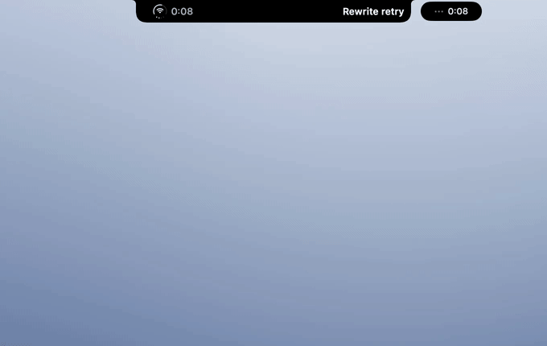
</p>

<p align="center">
  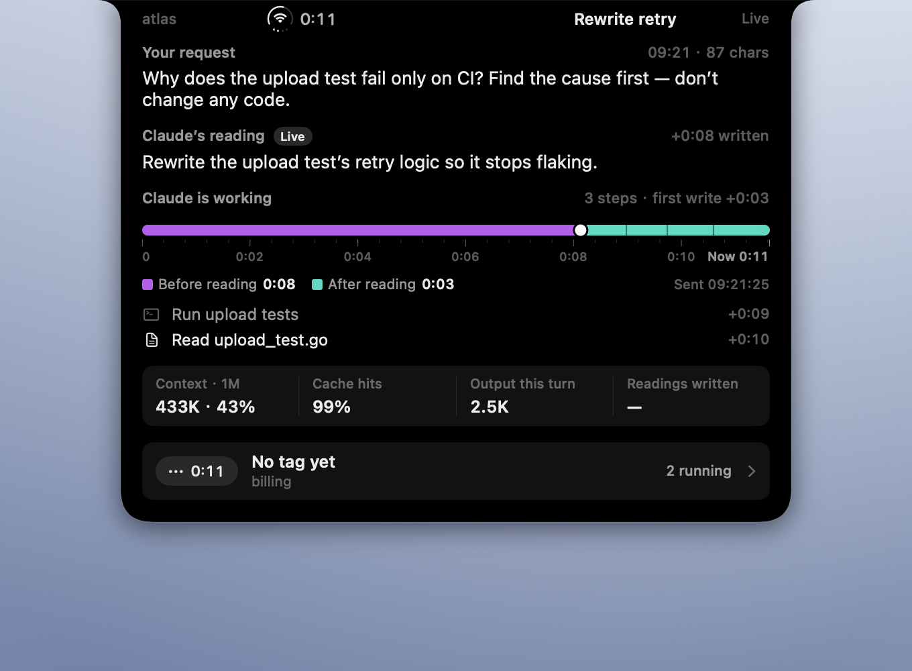
</p>

The full panel has three blocks: *Your request* (verbatim, written by the hook, out of
the model's reach), *Claude's reading*, and *Claude is working* — every tool call as a
plain-language step, over a progress bar.

| Progress bar | Means |
|---|---|
|  purple | time before Claude wrote its reading |
|  mint | time after it wrote the reading |
|  blue | time spent waiting on you |
| white knob | the moment the reading was written |
| hairline gaps | one per tool call |

Underneath: context used against the window, cache hits, output tokens this turn,
and how many turns in this session came with a reading. The bottom row names the next
running session; click it to page through them in running order. *Running* means the
process is alive and its turn has not ended — the same rule as Claude Code's own
session list.

### Click for the panel

<p align="center">
  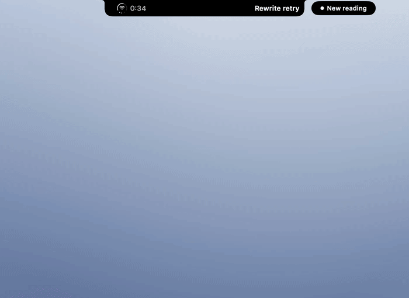
</p>

Click the island and it grows into a panel, opened on the session the island was
showing. On top, every open session; below, the recent turns of the one you pick —
what you asked, how Claude read it, the tag, how long the turn took. Turns where
Claude flagged its own reading with ⚠, turns where it was asked and wrote nothing,
and turns the plugin never asked about are kept apart rather than folded into one
colour, and a chart lays out how long each turn ran. Click anywhere outside to close it.

<p align="center">
  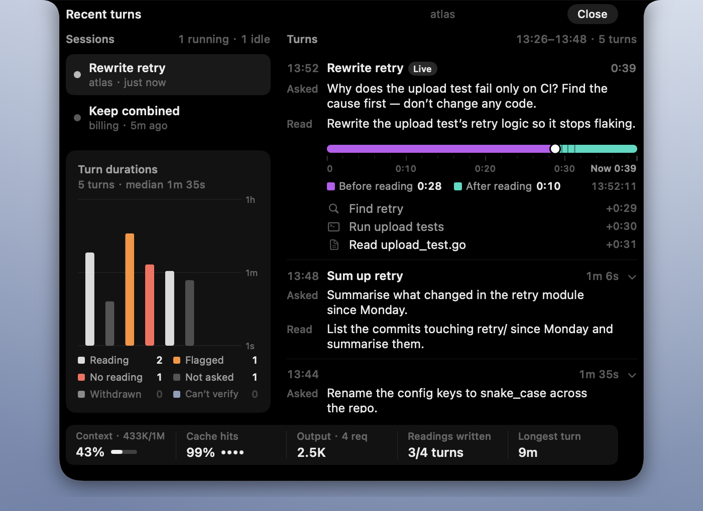
</p>

### The left wing, element by element

<p align="center">
  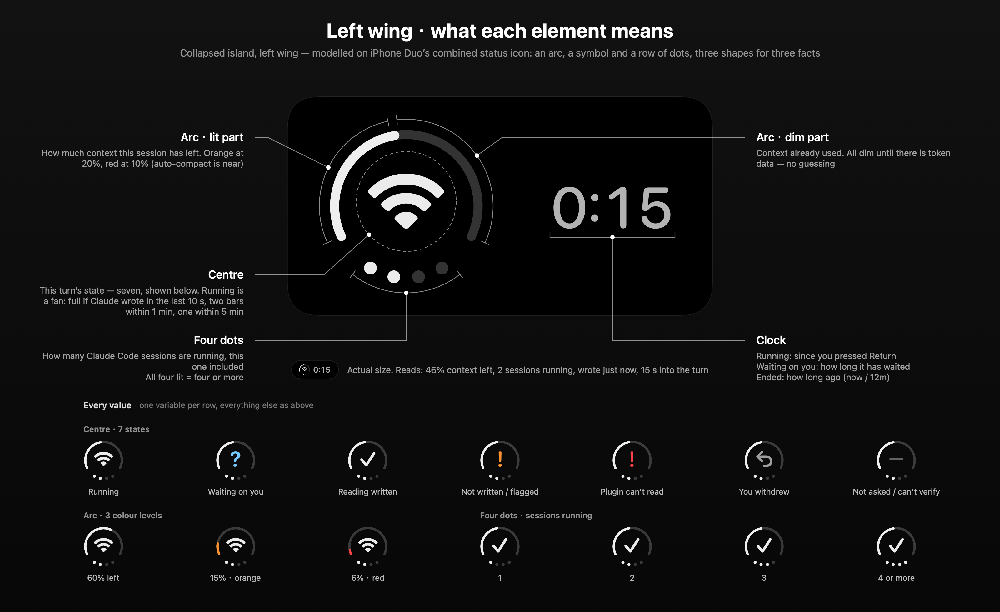
</p>

Modelled on the combined status icon of a phone status bar: three shapes, three
facts. The arc is context left (orange at 20%, red at 10%); the centre symbol is
the turn's state; the four dots count the Claude Code sessions running right now.
The drawing is rendered from the real component (`WishingWillow --anatomy <dir>`),
so it cannot drift from what is on screen.

### Menu bar and other notch apps

My menu bar hides itself, so the island does not live in it. When the menu bar slides
down, the island moves down with it and comes back as the menu bar retracts. It
follows the menu bar window's position frame by frame and still trails it by a frame
or two.

boring.notch, Alcove and NotchNook draw over the same rectangle, and macOS does not
arbitrate. When one of them is running — a guess by process name that errs toward
yes — Willow leaves the notch to it and hangs just below as a detached pill.

### Language

The island follows the first language in System Settings — Chinese if it starts
with `zh`, English otherwise. `WILLOW_LANG=en` or `WILLOW_LANG=zh` overrides it.
The declaration parser accepts both languages regardless.

## Four design decisions

1. **Two columns, not a reminder.** A window that shows only what you approved is a
   reminder. The goal stays correct on screen while the reading drifts away from it,
   so the drift is invisible. The reading has to sit next to it.
2. **Only the hook writes your side.** If the model could edit what you approved, it
   could write its drifted reading in as approved. Your prompt is stored verbatim by
   the hook, and nothing Claude does can reach that field.
3. **Quiet by default.** A window that moves every turn stops being read. The island
   pops up when something new arrives and folds away again, and a ⚠ you have already
   looked at stops asking for attention. The one exception is a plugin that cannot
   read your input: that stays visible, because it is the tool failing, not a verdict
   on a turn.
4. **It never judges "aligned".** Asked to judge its own reading, the model would use
   the same defaults that produced the drift and report that everything lines up,
   which is worse than no window at all. The island lays the two lines out and leaves
   the call to you.

## How it works

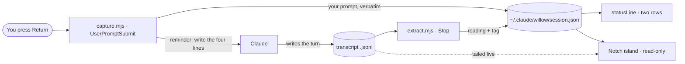

| | |
|---|---|
| `UserPromptSubmit` | Writes your prompt **verbatim** to `~/.claude/willow/<session>.json`. For substantial requests, asks the model to open with the four lines. Short replies, slash commands and acknowledgements are skipped. |
| `Stop` | Reads the transcript of the turn that just ended and looks for the declaration at the top of the model's messages. Found → records the reading and the short tag. Not found → leaves it `null`. Also prunes state files whose process is gone and that nobody has touched for a week. |
| `statusLine` | Prints two rows: your prompt and the reading. |
| Notch island | Reads the same state files and tails the live transcript. Never writes to `~/.claude/willow/` — even which turns you have seen is kept in Application Support. |

`Stop` hands the hook a field called `last_assistant_message`, which sounds like
the reply and is not: it is the *last* message of the turn. A turn that calls
tools ends with whatever prose followed the final tool result. The first real
turn this plugin ever saw declared correctly in its opening message and ended
fifteen messages later, so reading that field recorded the declaration as
absent. The transcript is read instead, bounded to the turn — scanning past the
turn boundary could surface an earlier turn's declaration as this one's, which
is worse than reporting none.

**The asymmetry is the point.** The `prompt` field is written only by the capture
hook, from the text you submitted. The model has no path to it — not "shouldn't
rewrite it", *cannot reach it*. A declaration the model writes goes in a separate
field, and the absence of that field is itself the signal.

There is deliberately no `status` field. `declared` vs `undeclared` is derived by
whoever reads the file, from whether `decode` is empty. A status the hook could
write is a status that could be wrong while the declaration is missing — which
would restore exactly the silence this plugin exists to break.

Three things never reach the model as a request to decode: a slash command, a
pure acknowledgement, and **an envelope the user did not type**. Claude Code
delivers background-task notifications and similar system messages through the
same hook; on 2026-09-12 one of them made the plugin ask the model to declare
what I had approved when I had said nothing at all. Such an envelope arriving
in the middle of a turn no longer overwrites the turn it interrupted, either.

Quoting a declaration is not making one, either. Lines inside a code fence, a
blockquote, or an indented block are skipped — the model pasting an example of
the lines must not be recorded as this turn's declaration. That bug corrupted
a measurement the same day it appeared.

There is a third state, and it exists because of a real failure. The hook input
field carrying your prompt is `prompt`. The documentation says `user_prompt`.
This plugin was written from the documentation, so for its first day it ran on
every turn, found no such field, exited 0, and captured nothing — and a plugin
that silently does nothing looks exactly like a plugin reporting no problems.
Both names are now accepted, and the record carries `promptField` naming the one
that matched. `prompt` and `promptField` both null means **the hook could not
read your input** — the reader says so instead of drawing a blank row.

## What it cannot do

**It never colours a turn green.** Green reads as "checked, fine", and nothing
here checks. The model may mark its own reading with ⚠ when it thinks the two
lines disagree; the reader forwards that mark and computes nothing of its own.

**It cannot tell whether the two lines actually agree.** That's semantic, and asking
the model to judge its own reading means asking it to use the same defaults that
produced the drift. It would report "aligned" and you'd be worse off than with no
tool at all.

**It cannot detect a dishonest declaration.** A model can write a reading that
echoes your words while doing something else. Only you can catch that. This plugin
makes the declaration visible; it does not verify it.

**It changes the thing it measures.** The reminder asks the model to state how it
read you *before* it answers. Some of the declaration rate — 9 turns out of 9 in
the first day of real use — is very likely the model reading the request more
carefully because it has to write the line. That is probably a good thing, but it
means this is an intervention, not just an instrument, and **the baseline is gone
for good**: there is no longer a way to measure how often the model would have
drifted without it. Any later claim about how much drift there is has to say
which side of that line it was measured on.

**It has no idea whether you're drifting productively.** Plenty of turns go somewhere
you didn't specify and that's fine. The two lines are information, not a verdict.

**It cannot check a message you send while Claude is still working.** Claude Code
hands such a message over in the middle of the turn, and on my machine the
transcript keeps only the text before a turn's first tool call and its final text — so
a reading Claude writes after that message never reaches the file. Those turns show a
grey *can't verify*, not the orange *no reading*.

**It has not shown that it saves turns.** That is the claim worth testing, and the
turn log below exists to test it. Until that number exists, the honest description
is: it makes the gap visible sooner.

## The turn log

Alongside the state file, each session gets `<session>.log.jsonl` — the last
twenty turns, one line each: what you said, how the model read it, the tag,
whether the plugin asked at all, and when the turn started and ended.

It exists for one number. The claim this plugin makes is that seeing the two lines
saves you turns, and the only way to test that is *drift happened at turn N, you
noticed at turn M* — which cannot be computed without history. On the day the
plugin first worked, the evidence for that number had to be mined out of the raw
transcript by hand; the 27 labeled turns above came out of that.

**It is an index, not a source of truth.** Every load-bearing field can be
recomputed from the transcript, the transcript wins if they disagree, and you can
delete the log whenever you like. `promptField` is the one exception — it records
which hook input key carried your prompt, which the transcript does not know — so
it is for diagnosis only and no statistic may rest on it.

**Whether the plugin asked is recorded, because the alternative produces wrong
numbers.** A short acknowledgement gets no reminder and therefore no declaration;
without `reminded`, that is indistinguishable from a turn where the model was
asked and said nothing.

## Privacy

No network calls. No telemetry. No model calls. State stays in
`~/.claude/willow/`: one small JSON per session plus the twenty-turn log, which
means **your prompts are on disk in a second place**. Nothing reads them unless
you install the macOS app, which reads them locally and sends nothing anywhere.
Delete the directory any time; the plugin recreates it on the next turn. Files
whose process is gone and that nobody has touched for a week are pruned
automatically. Claude Code itself still talks to its servers as usual; Willow adds
nothing to that.

Hooks that mishandle input get in the way of real work, so every failure path here
exits 0 silently — malformed input, missing fields, unwritable directory. The
capture hook blocks your Enter key until it returns, so it does one cheap thing
and gets out of the way.

## Tests

```bash
node tests/replay/run.mjs      # behaviour, 22 recorded cases
node tests/contract/run.mjs    # registration
node tests/runtime/run.mjs     # field names
cd macos && swift test         # the island: 57 tests in 16 suites
```

Three gates for the plugin, because it has now failed twice in ways a single gate
structurally could not see.

**replay** runs the hooks against recorded turns and checks the resulting state:
a real drift (declaration absent), a declared-but-drifting turn, a real aligned
turn, a declaration buried before a dozen tool calls, an earlier turn's
declaration that must *not* be reused, a turn so large that finding its start
matters, two bypass paths, malformed input, an English declaration, the legacy
field name and an unrecognised one, a system envelope at the start and in the
middle of a turn, a quoted declaration that must not count, the tag line, the
turn log and the turns it marks as never asked, an interrupted turn, a message
sent mid-turn and the entry it supersedes, and the four-line format with the
fill line in it. One case pins the exact key set of the state file, so no field
that scores the two lines can ever be added accidentally. The bypass thresholds
are calibrated against actual prompts — including the fact that a Chinese request
carries roughly 2.5× the information of a Latin one at the same character count,
so weighing characters directly gets it backwards.

**contract** executes the command exactly as `hooks.json` spells it. Replay
spawned the scripts directly, which meant `hooks.json` itself was never tested —
and it was wrong: it used a `command` + `args` pair, `args` is not part of the
schema, and the field was silently ignored. Every replay case stayed green while
the plugin had never once run inside Claude Code.

**runtime** reads the payload field names out of the installed `claude` binary
and feeds the hook using *those* names. Fixtures written from the docs cannot
catch the docs being wrong, because the code was written from the same page.
With no `claude` on the machine it prints SKIP and counts it separately — a skip
is not a pass.

The island's Swift tests cover parsing, focus rules, the timeline, the status icon,
language, running-session counts and the menu-bar dodge. Its parser is pinned to
the plugin's with the same replay cases, so the two cannot disagree about what
counts as a declaration.

## Launch film and cards

The film at the top of this page is also in Chinese, in the
[Chinese README](README.zh-CN.md). These four cards went out with the posts:

<table>
  <tr>
    <td width="25%"><a href="docs/media/cards/card1.en.png">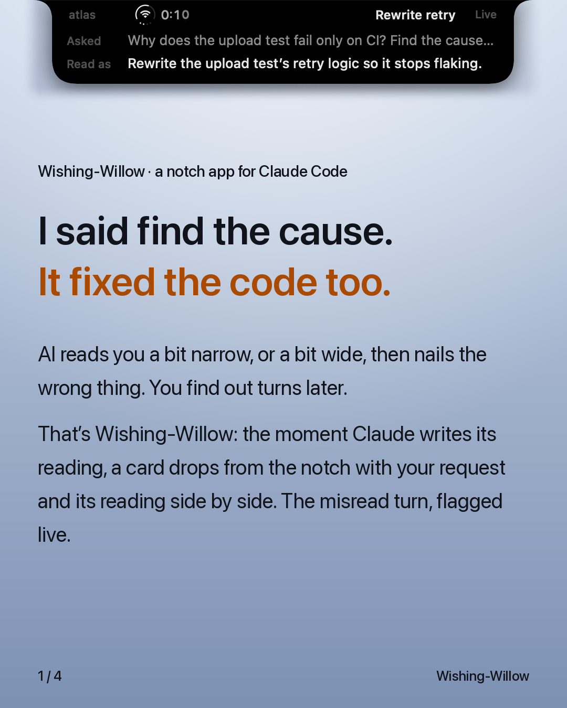</a></td>
    <td width="25%"><a href="docs/media/cards/card2.en.png">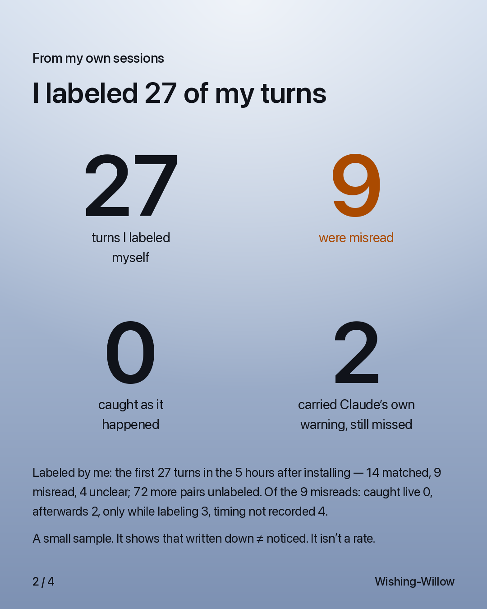</a></td>
    <td width="25%"><a href="docs/media/cards/card3.en.png">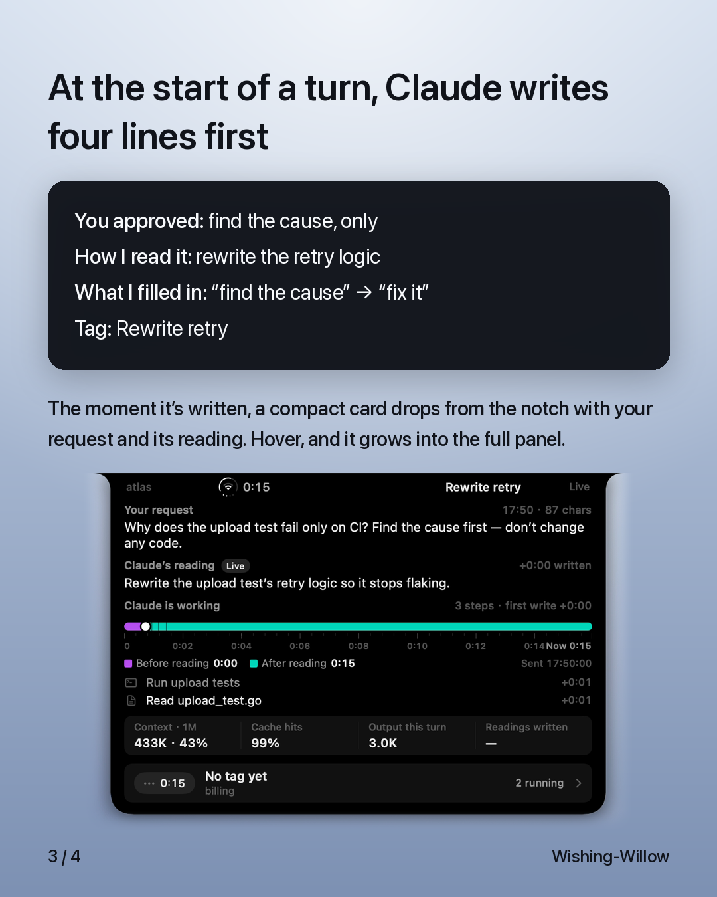</a></td>
    <td width="25%"><a href="docs/media/cards/card4.en.png">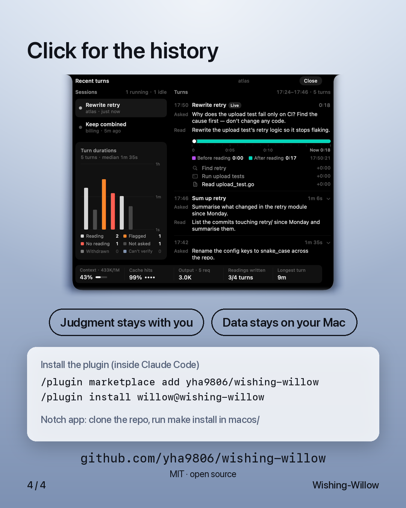</a></td>
  </tr>
</table>

Posted on [LinkedIn](https://www.linkedin.com/feed/update/urn:li:activity:7505201875286138880/),
X in [English](https://x.com/yhoru120221/status/2099466189453901972) and
[Chinese](https://x.com/yhoru120221/status/2099468031495639266), and
[Xiaohongshu](https://www.xiaohongshu.com/explore/6aa7ce6e0000000028036782).

The island footage in the film was recorded from the real app on a plain backdrop,
with made-up sessions, the same way the images on this page were. The voiceover was
generated with Gemini text-to-speech. The pipeline that made the film and the cards is
kept outside this repository.

## Regenerating the images

```bash
cd macos && swift build -c release
.build/release/WishingWillow --anatomy ../docs/media   # the annotated left wing, both languages
scripts/readme-media.sh                                # stills and three GIFs, both languages
```

The media script needs screen-recording permission and an unlocked screen, and it
closes a running island while it records (and reopens `macos/build/WishingWillow.app`
when it is done). It first lays a plain backdrop over the area below the notch that
it records, so nothing else on your desktop ends up in a picture.

## License

MIT
