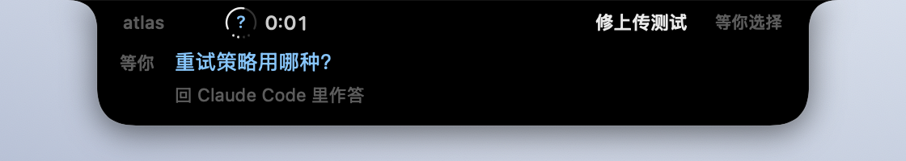
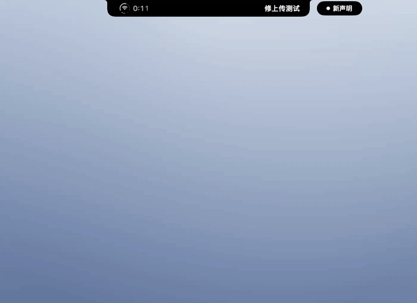
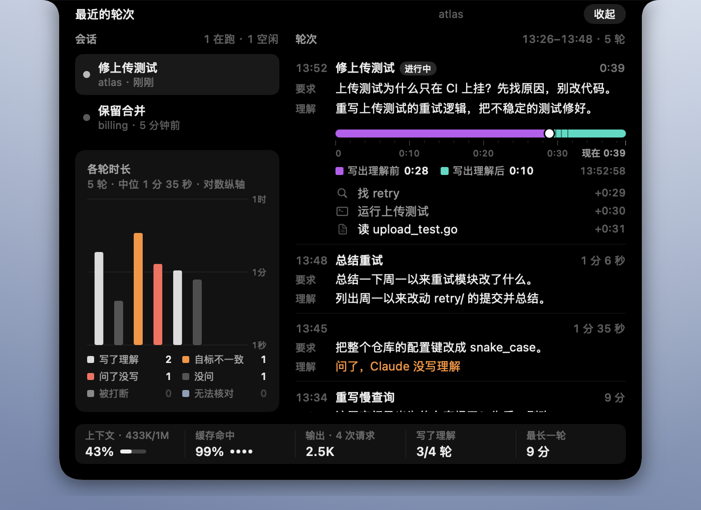
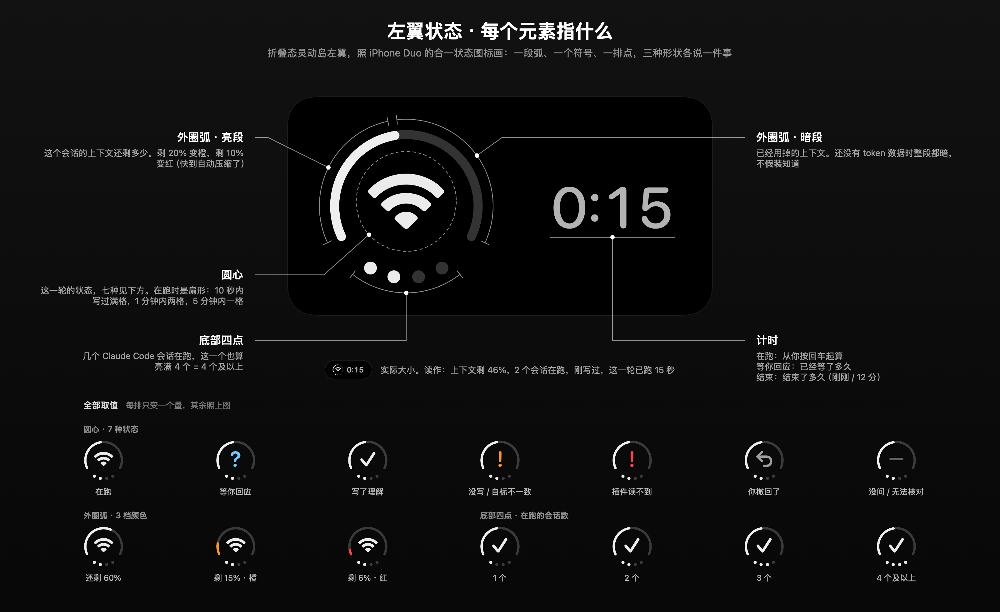
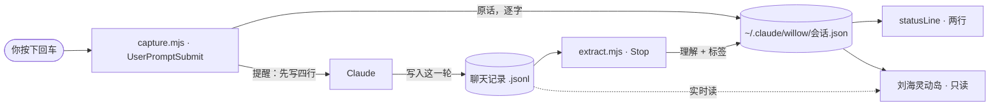
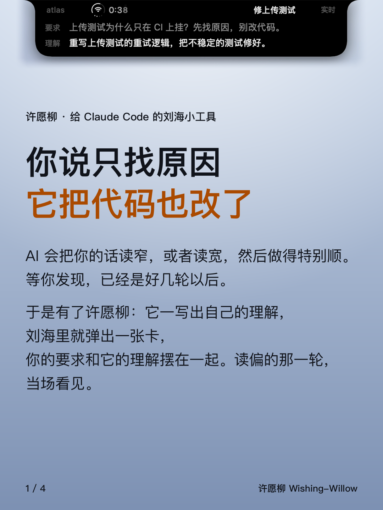
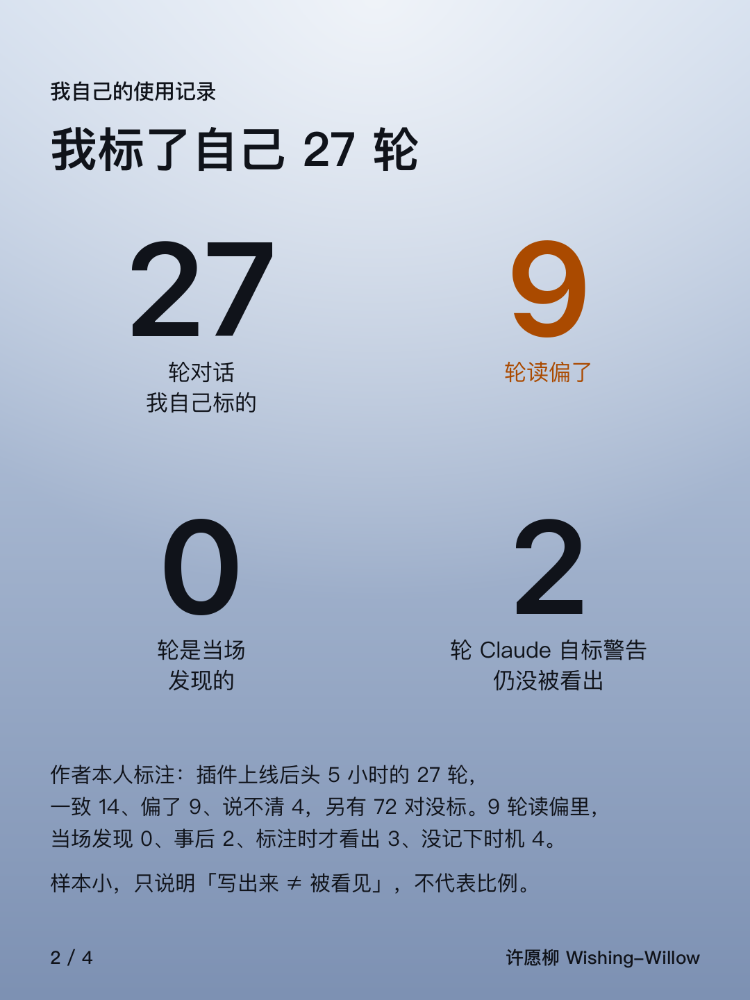
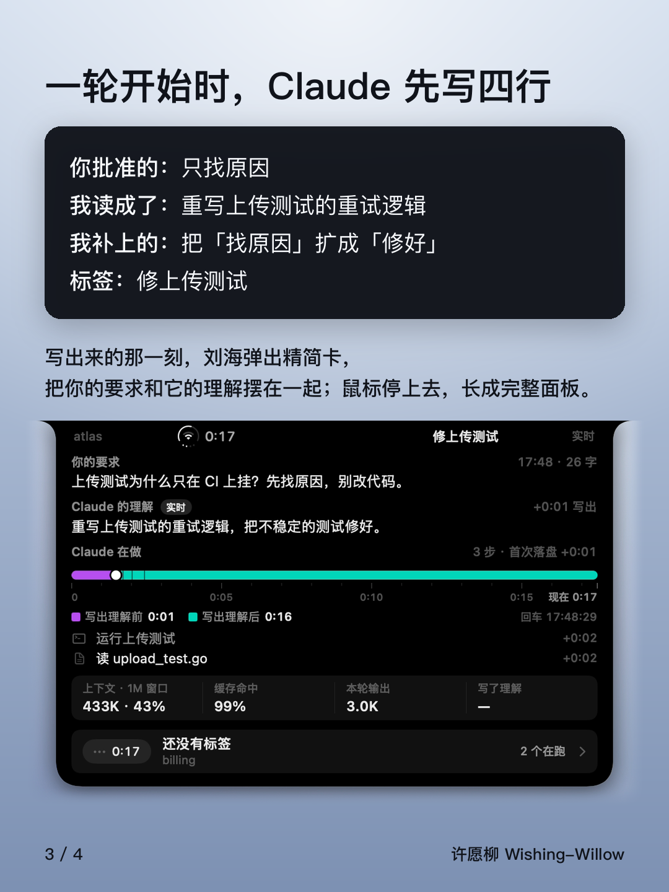
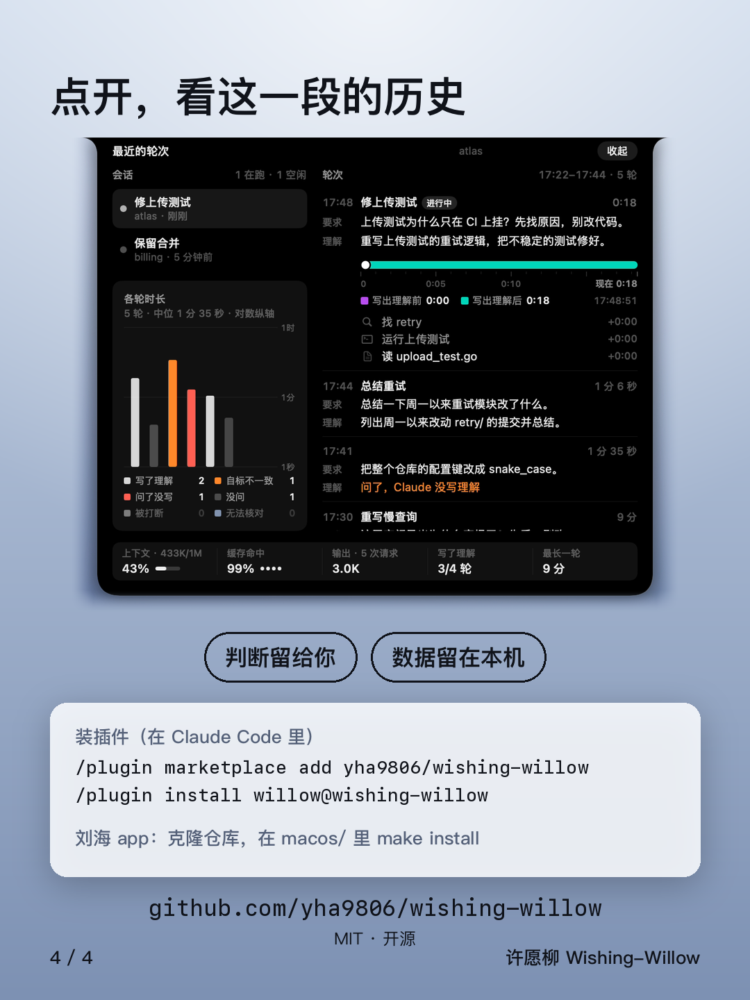

<h1 align="center">许愿柳 Wishing-Willow</h1>

<p align="center">
  <b>把 Claude 以为你要的，摆在你真正说的旁边。</b><br>
  一个 Claude Code 插件，外加一个 macOS 刘海灵动岛：Claude 一写出它怎么读的，两句话就从刘海里并排弹出来。
</p>

<p align="center"><a href="README.md">English</a> · 简体中文</p>

https://github.com/user-attachments/assets/15aa10dc-9329-4e20-aac4-cc14174f2c9f

<p align="center"><sub>40 秒的发布片。片中的会话是虚构的；灵动岛是真实的 app，在纯色底上录制。配音为合成语音。</sub></p>

许愿柳是我给 Claude Code 做的。Claude 有时会把我的话读得和我的意思差一点，回复却很通顺，我往往隔好几轮才发现。每轮开始时，插件的钩子把我的原话原样存在本机，并让 Claude 先写一行它读成了什么；这一行一出现，刘海里就落下一张小卡，把我的原话和它的理解并排摆出来。

它不给两句话打分，不拦任何操作，记录只存在本机。两句是否一致由你判断——这就是全部设计。

<p align="center">
  
</p>

<table>
  <tr>
    <td width="50%"></td>
    <td width="50%"></td>
  </tr>
  <tr>
    <td><b>要的是找原因，读成了改代码。</b>要求里写着「别改代码」，理解里写的是「重写重试逻辑」。Claude 没有标 ⚠，卡片保持白色，差别要你自己看出来。</td>
    <td><b>Claude 停下来问你了。</b>卡片把题面摆出来，叫你回 Claude Code 里作答。它从不替你选。</td>
  </tr>
</table>

<sub>图里的会话全部是虚构的。素材由 <a href="macos/scripts/readme-media.sh"><code>macos/scripts/readme-media.sh</code></a> 在空白底色上录制，驱动的是真实的插件钩子和真实的 app。</sub>

---

## 我为什么做它

在催生这个插件的那段对话里，同一件事发生了三次。第一次，我要的是「找这类问题背后的通用逻辑，要可复用的方案」，Claude 读成了「审计这个具体仓库、找证据」，并照此做了两轮。我到第三轮才发现。一路上每一条回复读起来都完全合理。

第二天，我要了一个窗口，让我能确认模型和我说的内容是对齐的。先做最小的：每一轮，Claude 先写下它把请求读成了什么。

Claude Code 对此已经有一部分答案——**计划模式**。它的官方文档举的例子几乎一模一样：
你要两行中间件，模型规划了一次管线重写，计划在第一处编辑之前就暴露了偏差。

但计划模式按**要改多少**触发——三个以上文件、schema、安全敏感代码——官方建议对
「单文件小改动或只读的问题」跳过它。上面三次偏移全部发生在**只读调查**里。
一个文件都没改，没有东西可以触发。

许愿柳补的就是这个缺口，而且只补这个缺口。它不替代计划模式。

## 我回头标了自己的轮次

装上插件的第二天，我回看它头 5 小时的记录，手工标了 27 轮：一致 14 轮，读偏 9 轮，说不清 4 轮。9 轮读偏里，当场发现 0 轮，事后发现 2 轮，标注时才看出 3 轮，另外 4 轮没记下是什么时候发现的。其中 2 轮 Claude 自己在理解前面标了 ⚠，我照样放过去了。那些轮次里的大多数，两行只出现在对话和状态栏里。

读偏的样子都很普通。我说可以发，它读成「整理成你按一下就能发」。我要讨论设计，它读成「先把候选做出来」。请求里的一项被丢掉。问题被换成相邻的另一个。请求里没有的先后顺序被补了进去。

也就是说，两行一直在写，我却没看见。所以灵动岛在两行写出的那一刻把它们弹出来，而不是留在往上翻的记录里。

这是我自己几轮对话的小样本，由我自己标注；那天另有 72 对没标。它说明偏移会发生、而且会被漏掉，说明不了有多频繁，也还没有任何东西证明灵动岛能减少偏移。

## 安装

**1 — 插件**（装上钩子立即生效）

```
/plugin marketplace add yha9806/wishing-willow
/plugin install willow@wishing-willow
```

**2 — 状态栏**（插件无法自带 `statusLine`，这一步省不掉）

```
/willow:setup
```

它会打印一段配置，贴进你的 `~/.claude/settings.json`。**它不会替你改设置。**
这段配置在运行时解析安装路径，所以插件升级不会让状态栏变空。

**3 — 刘海灵动岛**（可选，macOS）

```bash
git clone https://github.com/yha9806/wishing-willow
cd wishing-willow/macos
make app          # 用 SwiftPM 编译到 macos/build/
make autostart    # 立刻打开一次，之后每次登录自动打开
```

`make run` 只打开一次、不设登录项；`make autostart-off` 取消登录项。本机只留一份：
`make install` 会在 `/Applications` 再放一份，两份同时开着就是两个灵动岛叠在刘海上。

本机编译，不需要签名和公证：自己编译出来的二进制不带 quarantine 属性。详见 [`macos/`](macos/)。

## 环境要求

- Claude Code
- `PATH` 上有 **Node.js**——钩子是 `.mjs` 文件，以 `node …` 调用。
  Claude Code 是自带运行时的单一二进制，装了 Claude Code **不代表**装了 Node。用 `node --version` 确认。
- 灵动岛：macOS 26 及以上，Swift 6.2 工具链（Xcode 26 或它的命令行工具）。没有刘海的屏幕上会给一个同宽的虚拟刘海。
- 在 macOS 上测过。**Windows 没测过**——钩子配置用的是 exec 形式，理论上可移植，但没人在那里跑过。

缺 Node 时钩子会以非阻塞错误失败：许愿柳不工作，别的都不受影响。

## 四行

```
你批准的  只找出上传测试为什么只在 CI 上失败，不改代码。
我读成了  重写上传测试的重试逻辑，把不稳定的测试修好。
我补上的  把「找原因」扩成「修好」；改动范围定为 retry.go。
标签      修上传测试
```

对每个有分量的请求，capture 钩子都要求 Claude 在回复开头先写这四行，中英文都行。
在第二行开头标 ⚠ 是 Claude 自己的判断，它觉得前两行不一致时才标。

- **你批准的**和**我读成了**都是 Claude 写的。灵动岛不显示「你批准的」，那个位置显示的是你的原话，
  逐字，由钩子写下，Claude 碰不到。
- **我补上的**是用了一天之后加的。有一轮我问「有没有相关的 paper 发表过」，Claude 读成只查有没有人发表过相同主张；
  前两行彼此一致，也没有 ⚠，做完一轮我才补了一句「还要看会刊收不收」。「你批准的」也是 Claude 的措辞，
  会跟着理解一起偏；Claude 替你补上的默认值，要单独一行才看得见。插件不记录这一行，灵动岛也不显示，
  目前没有任何数据支撑它。有一个回放用例保证它不会被当成理解或标签。
- **标签**把理解压成 ≤6 个汉字（英文 ≤14 个字符），动词加宾语，好放进刘海右翼。它必须由 Claude 自己压，
  读方从不截断理解本身：一句以「不发送」收尾的理解截到 14 个字，恰好把「不发送」切掉，意思反了过来。

## 刘海灵动岛

状态栏在一轮结束后显示你的原话和理解；灵动岛在**这一轮还在跑的时候**就显示——它自己实时读聊天记录，
Claude 一写出理解就出现，不用等这一轮结束。

<p align="center">
  
  <br>
  
</p>

**收起**时是摄像头两侧的两翼。右翼写 Claude 给这一轮起的短标签；左翼是一个合一状态图标和计时。
另一个会话有话要说时，会分离成旁边的一个小胶囊——和灵动岛同时承载两个实时活动的做法一样。
没有新东西时，两翼缩回刘海。

**弹出**：Claude 写出理解，或者停下来问你的时候，刘海里落下一张精简卡：一行你的要求，最多两行理解；
Claude 标了 ⚠ 时理解变橙，等你回答时理解那一行换成题面。6 秒后收回。

**悬停**上去，它长成完整面板。

<p align="center">
  
</p>

<p align="center">
  
</p>

完整面板分三块：「你的要求」（原话逐字，由钩子写下，模型碰不到）、「Claude 的理解」、「Claude 在做」：
每次工具调用写成一句人话步骤，下面一根进度条。

| 进度条 | 含义 |
|---|---|
|  紫 | Claude 写出理解之前的时间 |
|  薄荷绿 | 写出理解之后的时间 |
|  蓝 | 等你回应的时间 |
| 白色圆点 | 写出理解的那一刻 |
| 细缝 | 每次工具调用一道 |

再往下：上下文占用与窗口大小、缓存命中、本轮输出 token，以及这个会话里有几轮写了理解。
底部一行是下一个在跑的会话，点它按在跑顺序逐个翻。「在跑」指进程开着、这一轮还没结束，
和 Claude Code 自己的会话列表是同一个规则。

### 点开面板

<p align="center">
  
</p>

点一下灵动岛，它长大成一块面板，停在灵动岛上正显示的那个会话。上面是所有开着的会话；下面是选中那个会话最近的轮次——
你说了什么、Claude 怎么读的、标签、这一轮用了多久。Claude 自己标了 ⚠ 的、问了却没写理解的、
插件根本没问的，分开记，不混成一种颜色；一张图摆出每一轮用了多久。点面板外面任意处收起。

<p align="center">
  
</p>

### 左翼，逐个元素

<p align="center">
  
</p>

照手机状态栏里的合一状态图标画：三种形状，各说一件事。外圈弧是剩余上下文（剩 20% 变橙、10% 变红）；
圆心符号是这一轮的状态；底部四点是此刻在跑的 Claude Code 会话数。
这张图由真实组件渲染（`WishingWillow --anatomy <目录>`），不会和屏幕上的东西漂成两套。

### 菜单栏与别的刘海 app

我的菜单栏是自动隐藏的，所以灵动岛不住在菜单栏里。菜单栏滑下来时，灵动岛跟着往下让，
菜单栏收回时再回位。它逐帧跟着菜单栏窗口的位置走，仍然落后一两帧。

boring.notch、Alcove、NotchNook 也在同一块矩形上画东西，系统不仲裁。检测到其中一个在跑
（按进程名猜，宁可误判成有），许愿柳就把刘海让给它，挂到刘海正下方，变成一个分离的小胶囊。

### 语言

灵动岛跟随「系统设置」里排第一的语言：以 `zh` 开头显示中文，否则显示英文。
`WILLOW_LANG=en` 或 `WILLOW_LANG=zh` 可以强制指定。解析声明时两种语言都认，与界面语言无关。

## 四个设计决定

1. **两栏，不是提醒器。** 只显示「你批准的」的窗口是一个提醒器：目标在屏幕上一直是对的，
   理解却在悄悄偏离它，偏移看不见。理解必须摆在它旁边。
2. **你那一栏只有钩子能写。** 如果模型能改你批准的内容，它就能把跑偏的理解写成已批准。
   你的原话由钩子逐字存下，Claude 做什么都碰不到那个字段。
3. **安静是默认。** 每轮都在动的窗口没人看。灵动岛只在有新东西时弹出，然后收回；你看过的 ⚠ 不再抢注意力。
   唯一的例外是插件读不到你的输入：那一条一直亮着，因为那是工具坏了，不是对某一轮的判断。
4. **从不判定「一致」。** 让模型评判自己的理解，它会用造成偏移的那套默认值来判，然后报告一切对齐——
   那比没有窗口更糟。灵动岛只把两句摆出来，判断留给你。

## 工作原理



| | |
|---|---|
| `UserPromptSubmit` | 把你的原话**逐字**写进 `~/.claude/willow/<会话>.json`。对有分量的请求，提醒模型先写四行。短回复、斜杠命令、确认类回复跳过。 |
| `Stop` | 读刚结束这一轮的聊天记录，在模型消息开头找声明。找到 → 记下理解和短标签；找不到 → 留 `null`。顺手清理进程已不在、一周没人碰的状态文件。 |
| `statusLine` | 打印两行：你的原话和理解。 |
| 刘海灵动岛 | 读同一批状态文件，实时读聊天记录。从不写 `~/.claude/willow/`——连「你看过哪一轮」都记在 Application Support 里。 |

`Stop` 交给钩子的字段叫 `last_assistant_message`，听起来像是回复，其实不是：它是这一轮的**最后一条**消息。
调用了工具的一轮，以最后一次工具结果之后的那段文字收尾。插件见到的第一个真实轮次在开头那条消息里正确写了声明，
十五条消息之后才结束，于是读那个字段就把声明记成了缺席。现在改读聊天记录，并限定在这一轮之内——
越过轮次边界可能把上一轮的声明当成这一轮的，那比报告没有更糟。

**不对称才是重点。** `prompt` 字段只由 capture 钩子根据你提交的文字写入。模型没有任何路径碰到它——
不是「不应该改」，而是**够不着**。模型写的声明放在另一个字段里，那个字段的缺席本身就是信号。

故意没有 `status` 字段。`declared` 与 `undeclared` 由读文件的一方根据 `decode` 空不空推出来。
一个钩子能写的状态，就是一个在声明缺失时可能写错的状态——那会恰好恢复这个插件要打破的沉默。

有三类东西永远不会被当作「请写出理解」发给模型：斜杠命令、纯粹的确认，以及**不是用户打的字**。
Claude Code 会通过同一个钩子送来后台任务通知这类系统消息；2026-09-12 就有一条让插件在我什么都没说的时候，
要求模型写出「我批准了什么」。这类信封在一轮进行中到达，也不再覆盖被它打断的那一轮。

引用一段声明也不算作声明。代码块、引用块、缩进块里的行一律跳过——模型贴出几行示例，不能被记成这一轮的声明。
这个 bug 出现的当天就污染过一次测量。

还有第三种状态，它的存在源于一次真实的故障。钩子输入里装着你原话的字段叫 `prompt`，文档写的是 `user_prompt`。
插件照文档写成，于是上线第一天每一轮都在跑、都找不到这个字段、都以 0 退出、什么都没记下——
而一个静默地什么都不做的插件，看起来和一个「没发现问题」的插件一模一样。现在两个名字都认，
记录里用 `promptField` 写明匹配到的是哪一个。`prompt` 与 `promptField` 同时为空，意思是**钩子读不到你的输入**——
读方会直说，而不是画一行空白。

## 它做不到什么

**它从不把一轮标成绿色。** 绿色读起来是「查过了，没问题」，而这里什么都没查。
模型觉得两句不一致时可以在自己的理解前面标 ⚠；读方原样转达这个标记，自己不计算任何东西。

**它判断不了两句是否真的一致。** 那是语义问题，让模型评判自己的理解，等于让它用造成偏移的那套默认值再答一遍。
它会报告「一致」，而你会比没有这个工具时更糟。

**它识别不了不诚实的声明。** 模型可以写一句复述你原话的理解，然后去做别的事。只有你能抓到。
这个插件让声明看得见，不负责验证它。

**它改变了它要测量的东西。** 提醒要求模型在回答**之前**写出它怎么读的。声明率——真实使用第一天 9 轮里 9 轮——
有一部分很可能是模型因为要写这一行而把请求读得更仔细了。这大概是好事，但意味着它是一次干预，不只是一件仪器，
而且**基线永久消失了**：再也没法测出没有它时模型会偏移多少。之后任何关于偏移有多少的说法，都得交代是在这条线的哪一侧测的。

**它不知道你的偏移是不是有益的。** 很多轮走向了你没指定的地方，那也没关系。两句话是信息，不是裁决。

**它核对不了你在 Claude 干活时追加的消息。** Claude Code 会在一轮中间把这条消息交给 Claude，
而在我的机器上，聊天记录只存一轮里第一次调用工具之前的文字和最后一段文字——Claude 之后写的理解进不了文件。
这类轮次显示灰色的「无法核对」，不显示橙色的「没写理解」。

**它还没有证明能省下轮次。** 那是值得检验的主张，下面的轮次日志就是为检验它而存在的。
在那个数出来之前，诚实的说法是：它让偏差更早被看见。

## 轮次日志

每个会话在状态文件旁边还有一个 `<会话>.log.jsonl`——最近二十轮，每轮一行：你说了什么、模型怎么读的、标签、
插件有没有提醒、这一轮何时开始何时结束。

它为一个数而存在。这个插件的主张是「看见两句话能省下轮次」，检验它的唯一办法是「第 N 轮发生了偏移，你在第 M 轮发现」——
没有历史就算不出来。插件第一次跑通的那天，这个数的证据只能从原始聊天记录里手工挖；上面那 27 轮就是这么挖出来的。

**它是索引，不是真源。** 每个关键字段都能从聊天记录重算，两者不一致时以聊天记录为准，日志随时可以删。
唯一的例外是 `promptField`——它记的是钩子输入里哪个键装着你的原话，聊天记录不知道这件事——所以它只用于诊断，
任何统计都不能建在它上面。

**插件有没有提醒会被记下，因为不记会算出错的数。** 简短的确认拿不到提醒，也就不会有声明；
没有 `reminded`，这和「提醒了但模型什么都没写」分不开。

## 隐私

不联网，没有遥测，不调用模型。状态留在 `~/.claude/willow/`：每个会话一个小 JSON 加二十轮日志，
这意味着**你的原话在磁盘上多了一份**。除非你装了 macOS app，否则没有东西读它们；app 只在本机读，不往任何地方发。
这个目录随时可以删，插件下一轮会重建。进程已不在、一周没人碰的文件会被自动清理。
Claude Code 本身照常联网，许愿柳不在这之上多发任何东西。

处理输入出错的钩子会妨碍真正的工作，所以这里每条失败路径都静默以 0 退出——输入格式错、缺字段、目录不可写。
capture 钩子会一直挡着你的回车直到它返回，所以它只做一件便宜的事，然后让开。

## 测试

```bash
node tests/replay/run.mjs      # 行为，22 个录下来的用例
node tests/contract/run.mjs    # 注册
node tests/runtime/run.mjs     # 字段名
cd macos && swift test         # 灵动岛：16 组 57 个测试
```

插件有三道关，因为它已经两次以单独一道关结构上看不见的方式坏过。

**replay** 用录下来的轮次跑钩子并检查结果状态：一次真实的偏移（声明缺席）、一次写了声明但偏了的轮次、
一次真实的一致轮次、埋在十几次工具调用之前的声明、一条**不能**被复用的上一轮声明、大到必须精确定位起点的一轮、
两条绕过路径、格式错误的输入、英文声明、旧字段名与一个认不出的字段名、一轮开头和一轮中间到达的系统信封、
不能算数的引用声明、标签行、轮次日志以及其中标为「没问」的轮次、被打断的一轮、一轮中途追加的消息和被它顶替的那一条，
以及带「我补上的」的四行格式。有一个用例钉死了状态文件的键集合，所以永远不可能意外加进一个给两句话打分的字段。
绕过阈值按真实原话校准——包括这个事实：同样字符数下，中文请求携带的信息量约是拉丁文字的 2.5 倍，
直接按字符数称重会把轻重弄反。

**contract** 严格按 `hooks.json` 的写法执行命令。replay 直接启动脚本，这意味着 `hooks.json` 本身从没被测过——
而它是错的：用了 `command` + `args` 的组合，`args` 不在 schema 里，被静默忽略。所有 replay 用例一路绿着，
而插件一次都没在 Claude Code 里真正跑过。

**runtime** 从安装好的 `claude` 二进制里读出载荷字段名，用**那些**名字喂钩子。照文档写的夹具抓不到文档写错，
因为代码是照同一页写的。机器上没有 `claude` 时它打印 SKIP 并单独计数——跳过不是通过。

灵动岛的 Swift 测试覆盖解析、焦点规则、时间线、状态图标、语言、在跑会话计数和菜单栏让路。
它的解析器用同一批 replay 用例和插件对齐，两边对「什么算声明」不可能产生分歧。

## 发布片与图卡

页首的发布片另有英文版，在[英文 README](README.md) 里。这四张图卡随帖子一起发出：

<table>
  <tr>
    <td width="25%"><a href="docs/media/cards/card1.zh.png"></a></td>
    <td width="25%"><a href="docs/media/cards/card2.zh.png"></a></td>
    <td width="25%"><a href="docs/media/cards/card3.zh.png"></a></td>
    <td width="25%"><a href="docs/media/cards/card4.zh.png"></a></td>
  </tr>
</table>

发在[小红书](https://www.xiaohongshu.com/explore/6aa7ce6e0000000028036782)、X 的
[中文](https://x.com/yhoru120221/status/2099468031495639266)与[英文](https://x.com/yhoru120221/status/2099466189453901972) thread，
以及 [LinkedIn](https://www.linkedin.com/feed/update/urn:li:activity:7505201875286138880/)。

做它们的全部东西都在 [`social/2026-09/`](social/2026-09/)：分镜（[`storyboard.md`](social/2026-09/storyboard.md)）、
成片管线（[`film4.py`](social/2026-09/film4.py)）、灵动岛录屏（[`record.sh`](social/2026-09/record.sh)，
用虚构会话在纯色底上录真实的 app）、图卡（[`cards.py`](social/2026-09/cards.py)）。
配音用 Gemini 语音合成生成。渲染出的成片不入库。

## 重新生成图片

```bash
cd macos && swift build -c release
.build/release/WishingWillow --anatomy ../docs/media   # 左翼标注图，中英两张
scripts/readme-media.sh                                # 静帧与三段动图，中英两套
```

素材脚本需要屏幕录制权限，屏幕要解锁；录的时候会关掉正在跑的灵动岛，结束后重新打开 `macos/build/WishingWillow.app`。
它会先在刘海下方要拍的那一块铺一层纯色底，桌面上的其他东西不会进到任何一张图里。

## 许可

MIT
