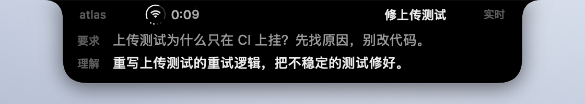
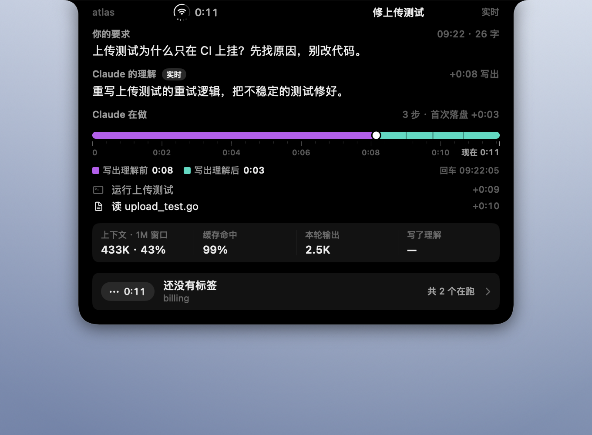

# 许愿柳 · 刘海灵动岛

把插件写在 `~/.claude/willow/` 里的东西显示出来。**只读**：这个 app 从不写那个目录，
连「你看过哪一轮」都记在 Application Support 里 —— 它手上根本没有那个目录的可写路径。

## 为什么在刘海，而且是黑的

先前默认走过菜单栏，理由是刘海会和别的 app 冲突。**真实截图把它推翻了**：
作者机器上 `_HIHideMenuBar = 1`，菜单栏自动隐藏，状态项大部分时间根本看不见——
「常亮」在菜单栏里不可能成立。窗口坐标也量过：那时的弹窗在 x = 0…486pt，
刘海在 x = 562…718pt，完全不在一处。

现在是无边框 `NSPanel`，`level = .mainMenu + 3`，菜单栏藏不藏都在。纯黑、顶边贴着
屏幕上沿、下方两角圆，和刘海连成一块。**不用玻璃**：浅色毛玻璃读起来是一个悬浮窗，
不是刘海长出来的东西。收起时中间 156pt 留空——那是摄像头，画了也看不见；
左翼是一枚合一状态图标加计时（外圈弧 = 剩余上下文，圆心 = 这一轮的状态，底部四点 = 在跑的会话数；
逐个元素见[标注图](../docs/media/left-wing-anatomy.zh.png)），右翼放模型自己压的 ≤6 字标签。

**菜单栏滑下来时让路。** 灵动岛跟着菜单栏窗口在窗口列表里的位置逐帧往下让，菜单栏开始收就回位，不自己计时；本机实测滑出约 0.1 秒、收回约 0.13 秒，岛仍落后一两帧（规则在 `App/DodgeRule.swift`）。

**和别的刘海 app 冲突怎么办。** boring.notch、Alcove、NotchNook 也在这一层盖同一块
矩形，系统不仲裁。检测到它们在跑（按名字的启发式，宁可误判成有），这里就**不抢那块
矩形**，改挂到刘海正下方 6pt——Apple 的灵动岛在多个活动并存时，本来就用一个分离的
小胶囊。没有刘海的外接屏上，给一个同宽的虚拟刘海。

## 四级

| | |
|---|---|
| 收起 | 两翼：左翼状态图标 + 计时，右翼标签。另一个会话有话要说时分离成旁边的小胶囊，悬停胶囊看它的标签 |
| 主动弹出 | **理解到达**或 **Claude 发问**（选择题、批准计划）时弹出精简卡：刘海一行 + 要求一行 + 理解最多两行（标 ⚠ 为橙色；发问时换成题面），6 秒后收回。没有新东西时两翼缩回刘海 |
| 悬停 | 停 0.3 秒长成完整面板：你的要求 / Claude 的理解 / Claude 在做（人话步骤 + 分段进度条）+ 上下文、缓存、输出、写了理解几轮；底部一行按在跑顺序翻到下一个会话 |
| 点击 | 面板：各会话，与灵动岛上正显示的那个会话最近 20 轮（逐轮可展开，附各轮时长图） |

主动弹出挂在「理解到达」上，而不是回车：回车那一刻还什么都没有，展开只能摆一行原话；
理解写出来的那一刻，两句才第一次能放在一起比。**运动用来报警，静止文字承载内容**——展开是原地静止的，
不是跑马灯。灵动岛自己实时读聊天记录，所以不用等这一轮结束。

进度条三段颜色：紫 = 写出理解之前，薄荷绿 = 之后，蓝 = 等你回应；白点是写出理解的那一刻，细缝是每次工具调用。





界面语言跟随系统首选语言（`zh` 开头为中文，否则英文），`WILLOW_LANG=zh|en` 可强制。

## 装

```bash
make run         # 编译并打开 build/ 里的那份
make autostart   # 登录后自动打开这一份（装上时立刻打开一次）；取消用 make autostart-off
```

不签名、不公证，因为**本机编译出来的二进制不带 quarantine 属性，Gatekeeper 不拦**。
需要那一套的是下载来的 app，而这个项目故意不走下载分发。

本机只留 `build/` 这一份：`make app` 换掉的就是开机打开的那个。`make install` 会在 `/Applications` 再放一份，
两份同时开着就是两个灵动岛叠在刘海上、各跑各的版本——自启指向 `build/`，不要再装那一份。

## 四种状态

| | 会话栏圆点 | 含义 |
|---|---|---|
| 已声明 | 绿 | 两栏都有，一致与否你自己看 |
| **未声明** | 黄 | 有原话，模型没写声明。**这一态是产品的全部意义** |
| **读不到输入** | 红 | hook 跑了但拿不到你说的话 —— **插件坏了，不是模型没说话** |
| 已陈旧 | 灰 | 进程没了、或十分钟没动静 |

**「已读」压过 ⚠。** 警报的任务是让你去看；你看过了它就该闭嘴。一直亮着的警报
会被学会忽略，而被忽略的警报等于没有。唯一的例外是「读不到输入」——那不是对
某一轮的判断，是工具本身不工作。

第三态不是装饰。这个插件已经有过三个版本，坏的样子都是「静默地什么都不做」，
在屏幕上和「一切正常」分不开。现在分得开了。

## 它不做什么

- **不判定两栏是否一致。** 那是语义问题，让模型判自己的解码等于让它用同一套默认值再答一遍。
- **不写任何状态。** `declared` / `undeclared` 是读的时候从 `decode` 空不空推出来的，
  磁盘上没有这个字段。能被写错的状态，就会在声明缺失的时候写错。
- **不联网。**

## 开发

```bash
make test        # 全部 swift 测试，含一关读磁盘上真实的状态文件
make snapshots   # 四种状态各渲一张 PNG，不需要任何权限
```

`make test` 里那一关会在没有真实文件时打 **SKIP** 并单独报出来 —— 跳过不是通过。

**验收只认真实屏幕。** 离屏渲染（`--snapshot`）和自拍（`--selfshot`，`cacheDisplay`）
都**不忠实**：前者整块吞掉控件，后者拍不到玻璃、vibrancy 和外观切换。真正的验收是
`--present <秒>`——正常启动、把面板真实摆在屏幕上、前一半收起后一半展开——期间用
`screencapture` 拍（需屏幕录制权限）；位置则用 `CGWindowListCopyWindowInfo` 取窗口坐标，
不要权限，和刘海坐标直接比。

**离屏渲染会吞掉整块 UI。** `ImageRenderer` 下面 `glassEffect`、`GlassEffectContainer`、
`ScrollView`、`HSplitView`、`List` 都不是画得难看，是**连子视图一起不画**，
而「消失」和「本来就没东西」在图上分不开。凡用到这几种容器的地方都要查
`Offscreen.isRendering` 并给一条等价布局 —— 见 `UI/Offscreen.swift`。

玻璃只用在三处（会话栏、警示条、溢出/退出按钮），集中在 `UI/WillowGlass.swift`，
**加第四处必须动那个文件**。内容面板一律不用：那两行是全部产品，要靠读来比较。

## 演示与 README 素材

| 参数 | 作用 |
|---|---|
| `--present <秒>` | 正常启动、摆在真屏幕上，停留这么久后退出。默认用内置样例数据，画面带黄色「演示」标记 |
| `--real` | 读 `WILLOW_STATE_DIR`（默认 `~/.claude/willow/`）里的状态，而不是样例 |
| `--passive` | 不强制展开，按真实事件（理解到达、发问）展开收起 |
| `--detail` / `--expand-then-detail` / `--pill-cycle` | 直接打开面板 / 先展开再打开面板 / 胶囊出场、悬停、收回一整圈 |
| `--flash` / `--flash-hover` | 像理解到达那一刻一样弹出精简卡 / 再过 2 秒模拟鼠标停上去，长成完整面板 |
| `--hover-cycle` / `--dodge-cycle` / `--flip-cycle` | 走一遍真实悬停路径 / 菜单栏让路再复原 / 悬停面板底部逐页翻会话 |
| `--backdrop` | 在刘海下方要拍的那一块铺底色（此时不画「演示」标记），拍出来的图里没有桌面上的其他东西 |
| `--anatomy <目录>` | 离屏导出左翼标注图，中英各一张 |

`scripts/readme-media.sh` 用插件自己的 `capture.mjs` 建虚构会话、逐行追加聊天记录，在 `--backdrop` 上拍中英两套静帧和三段动图（理解到达弹出精简卡、悬停长成完整面板、点开面板），
输出到 `docs/media/`。需要屏幕录制权限，屏幕要解锁；录的时候会关掉正在跑的灵动岛，结束后重新打开 `build/` 那一份。
